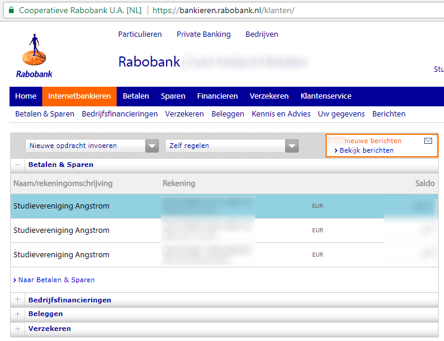
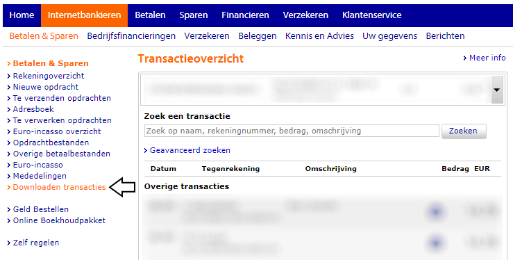
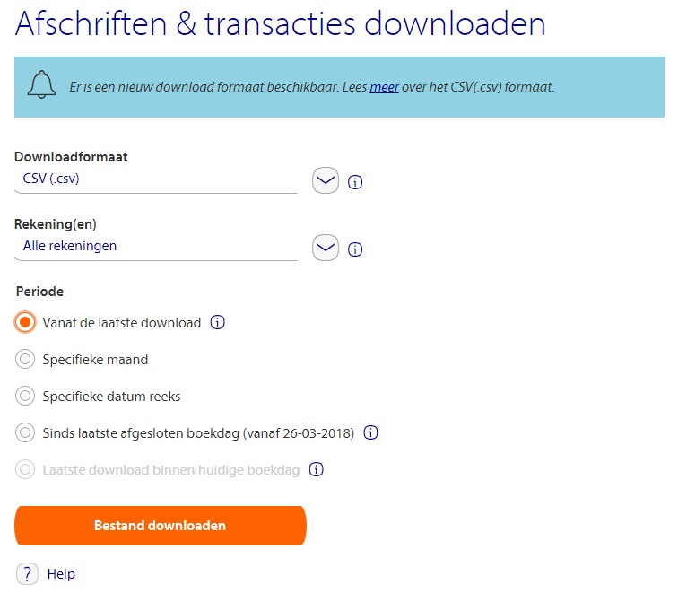
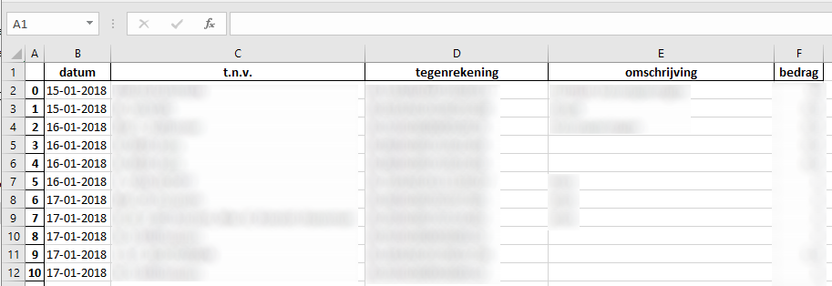

# Ångström financiën
Dit script zet de transactions.csv welke zijn gedownload via de Rabobank om naar een gebruiksvriendelijk Excel bestand. Hierdoor kunnen de transacties zoals deze in de Rabobank afschriften staan direct gebruikt kunnen worden in Excel voor de administratie van de financiën.

## Hoe te gebruiken
Volg onderstaand stappenplan om de transacties bij de Rabobank te downloaden.

1. Open de website van de [Rabobank](https://www.rabobank.nl/bedrijven/)
2. Ga naar het tabblad 'Internetbankieren' en klik op de betreffende rekening.

3. Links op het scherm is nu 'Downloaden transacties' zichtbaar, klik hier op.

4. Stel vervolgens de instellingen in zoals deze zijn weergegeven in onderstaande screenshot.

5. Klik op 'Bestand downloaden' en sla het bestand op in dezelfde folder als waar het python script staat opgeslagen.
6. Voer het Python script uit.
7. Open het gegenereerde 'transactions.xlsx' bestand en controleer via de website van de [Rabobank](https://www.rabobank.nl/bedrijven/) of de gedownloade transacties exact aansluiten met de huidige administratie. Wanneer er niet tussendoor transacties met de optie 'Vanaf de laatste download' gedownload zijn, dan zouden de gedownloade transacties netjes moeten aansluiten. Indien dit niet het geval is dan kan via de optie 'Specifieke datum reeks' de juiste datum reeks worden gekozen. Mogelijk is het dan wel nodig om enkele transacties aan het begin te verwijderen. Controleer daarom weer even of de transactie van cel 2, 3, ... in Excel niet al in de huidige administratie staat. Herhaal in iedergeval deze hele stap om er zeker van te zijn dat er geen transacties dubbel staan of ontbreken.
