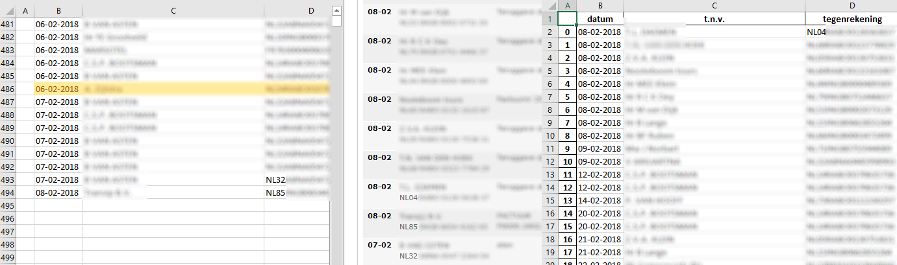

# Ångström financiën
In deze repository zit code welke gebruikt word bij de financiën van Ångström. Sommige code zal in de vorm van een .py bestand zijn. Echter komen er ook [Jupyter Notebooks](http://jupyter.org) voor, daar waar dat handiger is. Lees [hier](http://jupyter.readthedocs.io/en/latest/install.html) hoe je Jupyter installeert op je computer. Een korte uitleg: \
Installeer [Python3](https://www.python.org/). Open (op Windows) [CMD](https://en.wikipedia.org/wiki/Cmd.exe) als administrator (navigator? op macOS) en typ het volgende: \
`pip3 install jupyter` \
En voor bijvoorbeeld libraries: \
`pip3 install pandas` \
`pip3 install numpy` \
Om de notebook de starten kan `jupyter notebook` getypt worden, of run het run_notebook.bat bestand in de folder van de betreffende notebook.

## -- Transacties --
Dit script zet de transactions.csv welke zijn gedownload via de Rabobank om naar een gebruiksvriendelijk Excel bestand. Hierdoor kunnen de transacties zoals deze in de Rabobank afschriften staan direct gebruikt worden in Excel voor de administratie van de financiën.

### Hoe te gebruiken
Volg onderstaand stappenplan om de transacties bij de Rabobank te downloaden.

1. Open de website van de [Rabobank](https://www.rabobank.nl/bedrijven/)
2. Ga naar het tabblad 'Internetbankieren' en klik op de betreffende rekening.

3. Links op het scherm is nu 'Downloaden transacties' zichtbaar, klik hier op.

4. Stel vervolgens de instellingen in zoals deze zijn weergegeven in onderstaande screenshot.

5. Klik op 'Bestand downloaden' en sla het bestand op in dezelfde folder als waar het python script staat opgeslagen.
6. Voer het Python script uit.
7. Open het gegenereerde 'transactions.xlsx' bestand en controleer via de website van de [Rabobank](https://www.rabobank.nl/bedrijven/) of de gedownloade transacties exact aansluiten met de huidige administratie. Wanneer er niet tussendoor transacties met de optie 'Vanaf de laatste download' gedownload zijn, dan zouden de gedownloade transacties netjes moeten aansluiten. Indien dit niet het geval is dan kan via de optie 'Specifieke datum reeks' de juiste datum reeks worden gekozen. Mogelijk is het dan wel nodig om enkele transacties aan het begin te verwijderen. Controleer daarom weer even of de transactie van cel 2, 3, ... in Excel niet al in de huidige administratie staat. Herhaal in iedergeval deze hele stap om er zeker van te zijn dat er geen transacties dubbel staan of ontbreken. Het gegenereerde bestand ziet er als volgt uit.

### Controle van de transacties
Om stap 7 iets nader te specificeren is er in onderstaand figuur een voorbeeld van de controle te zien. Het linker Excel sheet is het bestand waar de administratie in word gedaan. Hier is te zien dat de laatste geadministreerde transactie is op datum *08-02-2018* van tegenrekening *NL85...*. In het middelste gedeelte is het transactie overzicht op de website van de Rabobank zichtbaar. Wanneer deze vergeleken word met de linker sheet dan is te zien dat de eerste transactie op *08-02* met rekeningnummer *NL85...* is geadministreerd. Vervolgens heeft er op *08-02* een transactie plaatsgevonden met *NL04...*. Deze staat niet in de linker sheet! De gedownloade transacties moeten dus bij deze transactie beginnen. Dit is het geval en het is zichtbaar in de rechter sheet. Hier is een transactie op *08-02-2018* met tegenrekening *NL04...*. 

Het downloaden en omzetten van de transacties is dus succesvol. Het rechtersheet kan gekopieerd worden en worden geplakt onder het einde van de linker sheet.

## -- Euro-incasso Adresboek -- 
Dit [notebook](euro_incasso_adresboek/EU-Incasso_adresboek_maken.ipynb) zet het ledenbestand in de 'input' folder om naar een .csv bestand welke bij de Rabobank geimporteerd kan worden in het EU incasso adresboek. Let er op dat wel handmatig 'vreemde' leestekens (Å, ö, ë...) moeten worden verwijderd. De Rabobank controleerd het .csv zelf en zal aangeven in welke rij er vreemde tekens zitten, of een incorrecte IBAN is etc. Pas het ledenbestand in de 'input' folder zo aan dat alle erros bij het importeren verdwijnen. Sla wel in een aparte Excel sheet de mensen met een incorrecte/lege IBAN op, zo kunnen ze later toegevoegd worden wanneer de juiste gegevens bekend zijn.